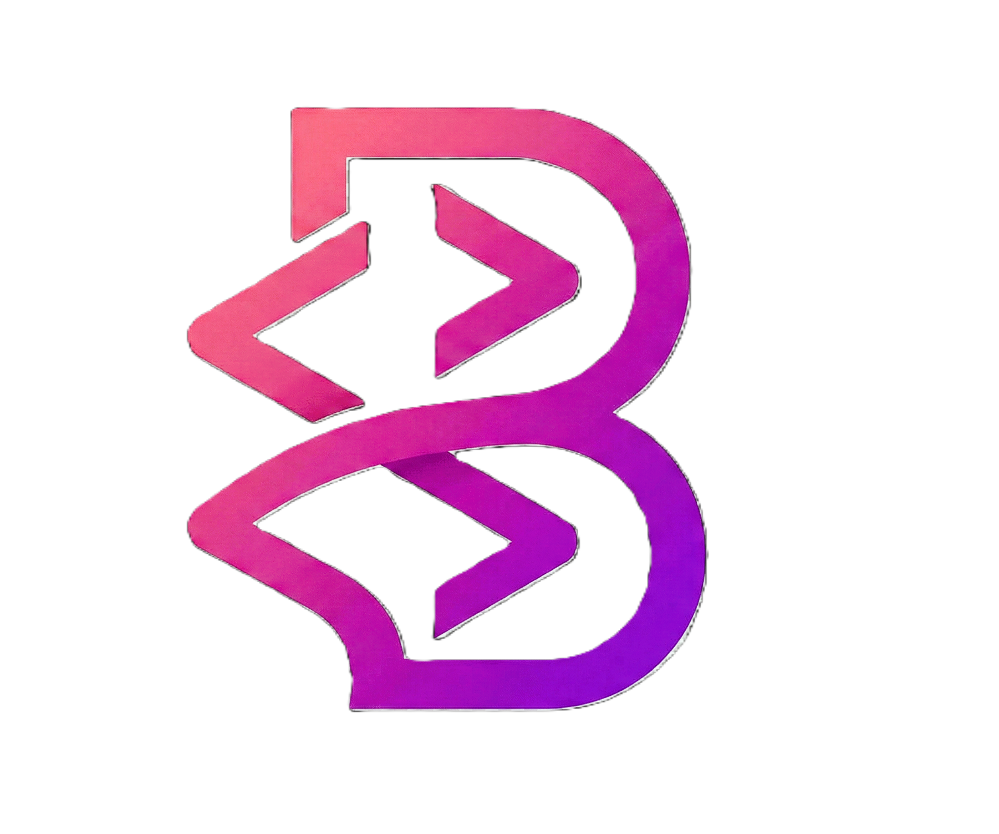

<div align="center">
  
  <h1>Bilal UI</h1>
  <p><strong>A modern, premium UI library for building beautiful web applications.</strong></p>

  <div>
    
    
    
    
  </div>

  <br />

  <p>
    <a href="#key-features">Features</a> •
    <a href="#quick-start">Quick Start</a> •
    <a href="#tech-stack">Tech Stack</a> •
    <a href="#project-structure">Structure</a>
  </p>
</div>

<hr />

## Key Features

-  **Next.js & React 19**: Built on the latest foundations for ultimate performance.
-  **Modern Design**: Premium, aesthetically pleasing components out of the box.
-  **Flexible & Modular**: Highly customizable components using Radix UI and Tailwind CSS.
-  **Documentation Ready**: Integrated with **Fumadocs** for beautiful, searchable docs.
-  **Dark Mode Support**: Seamless theme switching with `next-themes`.
-  **Smooth Animations**: Powered by **Framer Motion** for a dynamic user experience.

##  Tech Stack

| Category          | Technology                                                                  |
| :---------------- | :-------------------------------------------------------------------------- |
| **Framework**     | [Next.js](https://nextjs.org/) (App Router)                                 |
| **Styling**       | [Tailwind CSS v4](https://tailwindcss.com/)                                 |
| **Components**    | [Radix UI](https://www.radix-ui.com/) & [shadcn/ui](https://ui.shadcn.com/) |
| **Documentation** | [Fumadocs](https://fumadocs.vercel.app/)                                    |
| **Animations**    | [Framer Motion](https://www.framer.com/motion/)                             |
| **Icons**         | [Lucide React](https://lucide.dev/)                                         |
| **Forms**         | [React Hook Form](https://react-hook-form.com/) & [Zod](https://zod.dev/)   |

##  Quick Start

### 1. Clone the repository

```bash
git clone https://github.com/bilals2008/bilal-ui.git
cd bilal-ui
```

### 2. Install dependencies

```bash
npm install
```

### 3. Run the development server

```bash
npm run dev
```

Open [http://localhost:3000](http://localhost:3000) with your browser to see the result.

##  Project Structure

```bash
├── app/              # Next.js App Router (Pages & Layouts)
├── components/       # Custom UI components
│   ├── bilalUi/      # Bilal UI specific components
│   ├── landing/      # Landing page sections
│   ├── ui/           # Base UI primitives (Radix-based)
│   └── icons/        # Custom icons set
├── content/          # Documentation MDX files
├── lib/              # Shared utilities and configurations
├── public/           # Static assets (images, logos)
└── scripts/          # Helper scripts
```

##  Documentation

The documentation is located in the `content/docs` directory and is served via the `/docs` route. You can easily add or modify documentation by editing the MDX files.

##  Component Showcase

Explore the `components/landing` directory to see how the main landing page is constructed using our premium components such as:

- `hero.tsx`
- `feature-block.tsx`
- `templates-showcase.tsx`
- `interfaceCards.tsx`

---

## Acknowledgments

First of all, I would like to thank [shadcn](https://ui.shadcn.com) for the inspiration. I am grateful to everyone who uses Bilal UI, provides feedback, and helps me improve it. Thank you!

<p align="center">
  Built with <span style="color: #ef4444;">❤</span> by <a href="https://github.com/bilals2008">Bilal</a>
</p>
